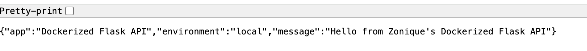
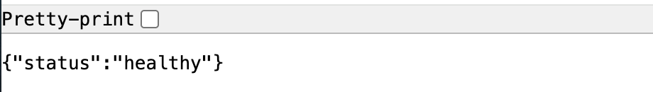
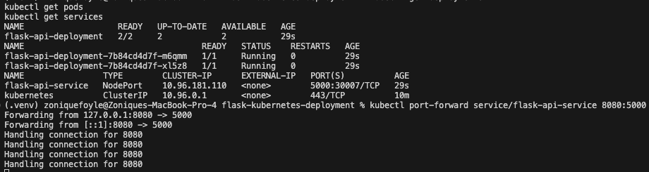
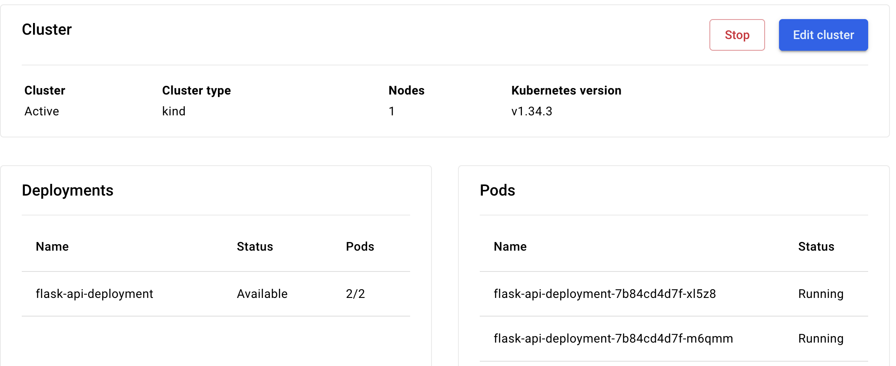

# Kubernetes Flask Deployment

A Kubernetes deployment project built to better understand container orchestration, scaling, and application management in modern cloud environments.

This project extends my earlier Dockerized Flask API project by deploying the application into a local Kubernetes cluster using Docker Desktop Kubernetes. The goal was to move beyond running a single container locally and learn how Kubernetes manages deployments, replicas, networking, and services in a more production-style workflow.

Instead of manually running containers one at a time, Kubernetes allows applications to be managed declaratively through YAML configuration files. This project helped me better understand how modern DevOps teams deploy and maintain containerized applications at scale.

## Project Goals

The main goals of this project were:

* Learn the fundamentals of Kubernetes architecture
* Deploy a containerized Flask application into a Kubernetes cluster
* Understand deployments, pods, replicas, and services
* Practice Kubernetes YAML configuration workflows
* Learn service exposure and port forwarding
* Understand how orchestration differs from standalone Docker containers
* Build familiarity with workflows commonly used in cloud and DevOps engineering

## Why Kubernetes

After building and containerizing a Flask application with Docker, the next logical step was learning orchestration. Docker works well for running containers individually, but Kubernetes provides more advanced capabilities for scaling, availability, service discovery, and infrastructure management.

I chose Kubernetes because it is widely used across modern cloud platforms and DevOps environments. Since many cloud engineering roles involve working with containerized workloads, I wanted hands-on experience deploying and managing applications inside a Kubernetes cluster rather than only understanding the concepts theoretically.

## Architecture

Browser Request
↓
Kubernetes Service
↓
Kubernetes Deployment
↓
Flask Application Pods
↓
Docker Containerized Flask API

## Technologies Used

* Kubernetes
* Docker Desktop Kubernetes
* Docker
* Flask
* Python
* YAML
* kubectl

## Kubernetes Components

### Deployment

The deployment manages the Flask application pods and ensures the desired number of replicas remain running.

### Pods

The application runs across multiple pods to simulate a more resilient deployment model.

### Service

A Kubernetes NodePort service exposes the application internally and allows local access through port forwarding.

### Port Forwarding

kubectl port-forward was used to expose the Kubernetes service locally for browser testing.

## Features

* Kubernetes deployment configuration
* Multi-pod Flask deployment
* Kubernetes service exposure
* Container orchestration using Kubernetes
* YAML-based infrastructure configuration
* Local Kubernetes cluster management
* Health endpoint testing
* Replica-based deployment model

## Deployment Files

### deployment.yaml

Defines:

* deployment configuration
* replica count
* pod labels
* container image
* exposed container port

### service.yaml

Defines:

* Kubernetes service
* NodePort exposure
* service-to-pod routing
* local network access configuration

## Running the Project

This project runs locally using Docker Desktop Kubernetes. The application is exposed through kubectl port-forward on localhost only and is not publicly accessible from the internet.

### Apply Kubernetes resources

```bash
kubectl apply -f deployment.yaml
kubectl apply -f service.yaml
```

### Verify deployments

```bash
kubectl get deployments
kubectl get pods
kubectl get services
```

### Port forward the service

```bash
kubectl port-forward service/flask-api-service 8080:5000
```

### Access the application

```text
http://localhost:8080
```

### Health endpoint

```text
http://localhost:8080/health
```

## Project Structure

```text
flask-kubernetes-deployment/
│
├── screenshots/
│   ├── kubernetes-flask-api-browser.png
│   ├── kubernetes-health-endpoint.png
│   ├── kubernetes-services-deployments.png
│   └── docker-desktop-kubernetes.png
│
├── deployment.yaml
├── service.yaml
├── README.md
└── .gitignore
```

## Screenshots

### Flask API Running in Kubernetes



### Health Endpoint



### Kubernetes Deployments and Services



### Docker Desktop Kubernetes Dashboard



## Tradeoffs and Lessons Learned

One of the biggest learning points in this project was understanding the difference between containerization and orchestration. Docker solved the problem of packaging the application consistently, while Kubernetes introduced a completely different layer focused on scaling, service management, deployment control, and workload orchestration.

Another important lesson was understanding how Kubernetes networking differs from traditional local application hosting. While the application pods were running successfully, local access required port forwarding because of how services are exposed within the Kubernetes networking model.

I also gained a better understanding of declarative infrastructure workflows through YAML manifests. Rather than manually managing containers, Kubernetes resources are defined through configuration files that describe the desired application state.

This project intentionally focused on foundational Kubernetes concepts rather than production-grade complexity. The goal was to build a strong understanding of deployments, pods, services, and orchestration workflows before moving into more advanced Kubernetes topics.

## Future Improvements

* Add Ingress configuration
* Add ConfigMaps and Secrets
* Add Kubernetes health probes
* Add Horizontal Pod Autoscaling
* Deploy to a managed cloud Kubernetes service
* Add CI/CD automation for Kubernetes deployments
* Integrate monitoring and observability tooling
* Add Helm chart support

